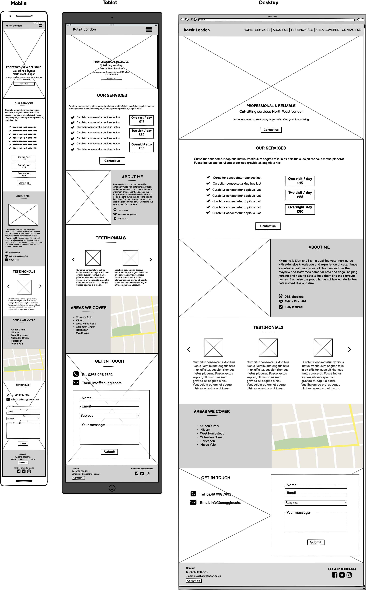
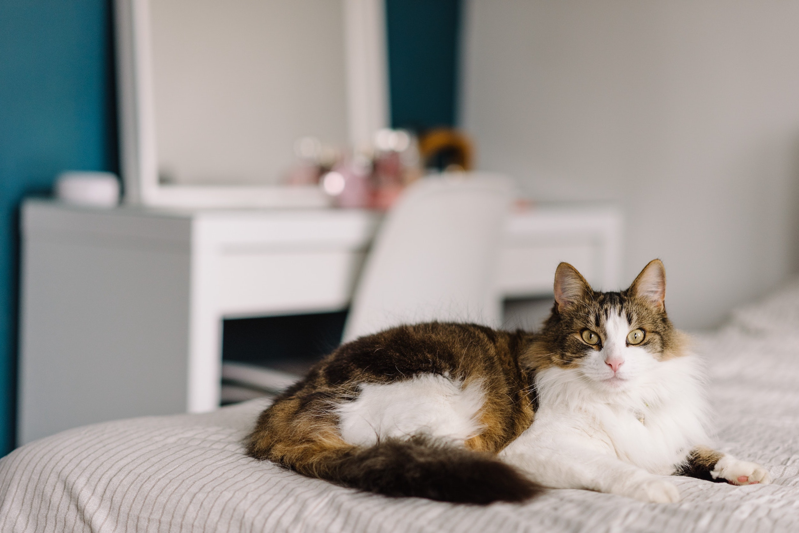
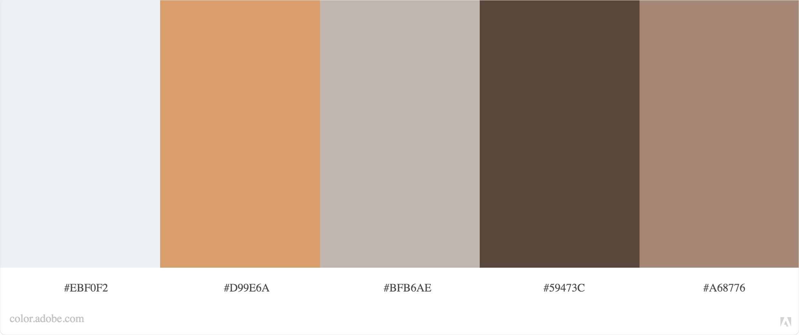
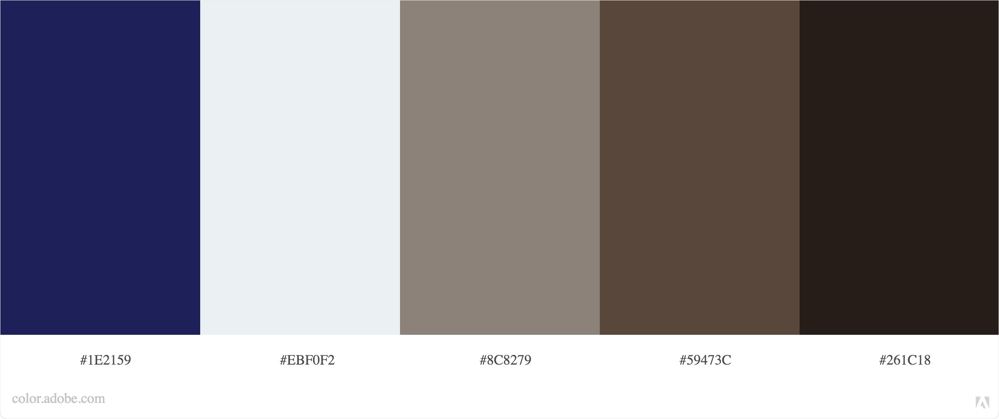

# **Katsit London - Cat sitting agency in London**

Based on a fictional business offering cat sitting services, this website was built for educational purposes as part of the Code Institute's Full Stack Development course. This fully responsive and user centric website was designed using the principles of User Experience Design and developed using HTLM, CSS and bootstrap framework. 

# Strategy


*(add screenshots)*


Katsit London is a small cat sitting company set up by a previous veterinary nurse, who has extensive knowledge and experience in caring for animals. The business has already a formidable reputation, attracting new customers from recommendations and local pages on social media.
 
Katsit London is fast expanding  and needs a simple, yet comprehensive and responsive website to create an online presence and advertise their services. 
 
### <ins>Business goals</ins>
 
The company needs a fully responsive and user centric website in order to:
- To create an online presence
- To advertise their services and pricing
- To raise business' brand awareness and credentials
- To generate new leads and expand their customer base.
- To grow their on-line community.
 
### <ins>User goals</ins>
 
Cat owners can feel quite anxious at the idea of leaving their pets at home whilst on holiday and need to trust that their pets will be well looked when they are away. Therefore they may have the main following goals in mind when visiting a website:
 
- To access the website across different devices and quickly find information.
- To assess business’s credentials.
- To decide whether the services offered by the company fit their needs.
- To check whether the prices are affordable.
- To seek reassurance that the company is cat friendly.
- To check whether the company operates where they live.
- To reach the company for further queries and/or to arrange a meeting. 

# Scope

## **User stories**

**<ins>1 - External user stories:</ins>** 
 
**As a first time visitor,**
- I want a responsive website so that I can view the website across different devices. 
- I want to be able to easily navigate across the website so that I can quickly find information.
- I want to read about the company's services so that I can assess whether they fit my needs   
- I want to look at prices so that I can check wether I can afford their services. 
 
**As a returning visitor**
- I want to read customer testimonials so that I can assess if the company is reliable and professional.
- I want to read more about the company so that I can assess its credentials, professionalism and cat friendliness. 
- I want to access contact options so that I can reach the company for further queries.
- I want to view the areas where the company operates so that I can check that they provide services where I live.
 
**As a frequent visitor:**
- I want to quickly access the company social media account so that I can further check their credentials.
- I want to contact the company so that I can arrange a meet & greet.

<ins>**2 - Business owner stories**</ins> 
 
As a business owner: 
 
- I want a user-friendly responsive website so that I can create an online presence.
- I want to provide clear and concise information so that I can advertise services and pricing.
- I want a call for action so that I can generate leads.
- I want to feature a logo and a tagline so that I can raise my business brand awareness.
- I want to feature my profile so that I can raise my business credentials.
- I want to encourage users to contact us so that we can answer queries promptly and arrange meet-ups.
- I want to provide links to our social media accounts so that I can grow my online community.

## **Features**

**Responsive layout:** 

The website will resize according to the device used for better visibility and user experience. 

```
- As a first time visitor, I want a responsive website so that I can view the website across different devices. 
- As a business owner, I want a user-friendly responsive website so that I can create an online presence.
```

**Collapsible navigation menu:** 

The website will feature a fixed navigation menu on top of the page to allow users to easily navigate back and forth. The navigation will be collapsible on mobile devices for better visibility and automatically update according to the user's position on the page for better user experience.

```
- As a first time visitor, I want a responsive website so that I can view the website across different devices. 
- As a first time visitor, I want to be able to easily navigate across the website so that I can quickly find the information I need. 

- As a business owner, I want a user-friendly responsive website so that I can create an online presence.
```

**Hero banner section:** 

This section will feature a hero image with a tagline and a call for action. 

```
- As a business owner I want to feature a logo and a tagline so that I can raise my business brand awareness.
- As a business owner, I want a call for action so that I can generate leads.
```

**Services section:**

This section will feature a description of what is included in the services as well pricing and a call for action to encourage users to contact the company.

```
- As a first time user, I want to read about the company's services so that I can assess whether they fit my needs   
- As a first time user, I want to look at prices so that I can check wether I can afford their services. 

- As a business owner, I want to provide clear and concise information so that I can advertise services and pricing.
- As a business owner, I want a call for action so that I can generate leads.
```

**About us section:** 
 
 This section will feature the profile, a photo and the relevant qualification of the business owner to provide users with information about the business' credentials. 

```
- As a returning visitor, I want to read more about the company so that I can assess its credentials, professionalism and cat friendliness.  
- As a business owner, I want to feature my profile so that I can raise my company's brand awareness and credentials.
```

**Testimonials section:**

This section will feature quotes from customers, including full names and photos to add further credibility. The testimonials will be presented in a responsive carousel for better user experience.

```
- As a returning visitor, I want to read customer testimonials so that I can assess if the company is reliable and professional.

```

**Areas we cover section:**

This section will list the areas the business covers and will feature an embedded map to help users to visualise  where the business operates. Users can use the search tool on the map to look-up if their post-code is in the area covered by the business.

```
- I want to view the areas where the company operates so that I can check that they provide services where I live.
```

**Contact us section:** 

The contact page will feature the business' contact details and social media accounts including links opening into new tabs so that users can browse without losing access to the website. This section will also feature a form to allow users to contact the business directly via the website. The form will include an option to select the subject of the message so that users can either make a general query or arrange a meet and greet. 

```
- As a returning visitor, I want to access contact options so that I can reach the company for further queries.
- As a frequent visitor, I want to contact the company so that I can arrange a meet & greet.
- As a frequent visitor, I want to quickly access the company social media account so that I can further check their credentials.

- As a business owner, I want to encourage users to contact us so that we can answer queries promptly and arrange meets & greets.
```

**Footer:** 
 
 The footer will display contact information  and icons with links to the business’s social media accounts opening onto a new tab, so that users can browse without losing access to the website. 

```
- As a frequent visitor, I want to contact the company so that I can arrange a meet & greet.
- As a frequent visitor, I want to quickly access the company social media account so that I can further check their credentials.

- As a business owner, I want to provide links to our social media accounts so that I can grow my online community.
```

### **Features left to implement**

(if any)

# Skeleton

## **Wireframes** 

The wireframes were created using Balsamic during the skeleton plane of the project and illustrates the structure of the website across different devices.

You can download the pdf version of the wireframes should the images not display properly. 
[download pdf wireframes](https://a45c73f1-3de6-45f3-bdf8-7fdbe308ac5f.ws-eu03.gitpod.io/files/download/?id=bdb7e86e-0825-49b6-a2f7-0cc69646e029)





# Design

#### Imagery

The hero image on the homepage - featuring a cat - has for main objective to illustrate the purpose of the business. 
The image was sourced from Pexels. 



All images on the website are featuring cats and were sourced from Pexels. 

Please find using the link below the full list of credits. 

#### Colour scheme

The colour palette was created using Adobe Color and the hero image from the homepage.




The following colours from the palette are used across the website and have been selected for their contrast whilst keeping in harmony with the main image.

- ... is used for both header and footer.
- ... is used for all text on light background and also for some section panels to add contrast.
- ... is used for headers, icons, buttons and horizontal lines when on light background.
- ... is used for text, icons and buttons on dark background. 


#### Fonts

The website uses Open Sans as primary font, whilst the headings and subheadings uses the secondary font Poppins, which pairs nicely with Open Sans. 
Both fonts were sourced from Google fonts and were selected for their round edges, which add softness to the website.  

#### Icons

Icons are from the Font Awesome library and used mostly to bring attention to contact details and social media accounts. Icons will also be used to reinforce the services offered. 

#### Styling
*Explain if you applied a particular style of styling for particular reason - ex using rounded corners because it's more child friendly*


#### Differences to design
(*If any*)

#### Limitations


# Technologies used

The following technology were used during the development and testing of the website:

Technology | Usage
------------ | -------------
HTML | HTML was used to structure the page 
CSS | CSS was used to style the different elements on the page.
[Bootstrap](https://getbootstrap.com/docs/4.5/getting-started/introduction/)  | Bootstrap library was used to build the layout using the grid system, the navigation and part of the form.
[Flickity](https://flickity.metafizzy.co/) | Flickity was used to build the responsive carousel in testimonial section.
[Hover.css](http://ianlunn.github.io/Hover/) | Hover.css library was used for hovering effects on buttons and social media icons.
[Carto](https://carto.com/) | Carto was used to draw and personalise the embedded map.
[Google font](https://fonts.google.com/) | Google font API was used for the fonts on the website.
[Font Awesome](https://fontawesome.com/) | Font awesome library was used for the icons the website. 
[Chrome DevTools](https://developers.google.com/web/tools/chrome-devtools) | Google inspect was used to test and fix code and page responsiveness.
[Responsive viewer](https://www.producthunt.com/posts/responsive-viewer) | This add-on was used to test website responsiveness across different devices.
[Balsamiq](https://balsamiq.com/wireframes/) | Balsamiq was used to design the wireframe.
[Ibis Paint](https://ibispaint.com/?lang=en-US) | Ibis Paint app was used to alter the logo and the favicon.
 
# Testing

*Testing & Deployment should be done towards the end of coding project*

*In this section, you need to convince the assessor that you have conducted enough testing to legitimately believe that the site works well. Essentially, in this part you will want to go over all of your user stories from the UX section and ensure that they all work as intended, with the project providing an easy and straightforward way for the users to achieve their goals.*

*Whenever it is feasible, prefer to automate your tests, and if you've done so, provide a brief explanation of your approach, link to the test file(s) and explain how to run them.*

*For any scenarios that have not been automated, test the user stories manually and provide as much detail as is relevant. A particularly useful form for describing your testing process is via scenarios, such as:*

*Contact form:*
*Go to the "Contact Us" page*
*Try to submit the empty form and verify that an error message about the required fields appears*
*Try to submit the form with an invalid email address and verify that a relevant error message appears*
*Try to submit the form with all inputs valid and verify that a success message appears.*
*In addition, you should mention in this section how your project looks and works on different browsers and screen sizes.*

*You should also mention in this section any interesting bugs or problems you discovered during your testing, even if you haven't addressed them yet.*

*If this section grows too long, you may want to split it off into a separate file and link to it from here.*

### **Scope** 
*Different browser/layout/links/navigation/image rendered*
*Most common path Home/courses/book*

### **Test validation criteria**
*Testing user stories*
*w3c html validation*
*w3c css validation*
*google inspect*

### **Test results**
*table with bugs and debugs*

### **Issues and resolutions**


# Deployment

There is no difference between the developed and the deployed version. 


### **Project inception**

This project was developed using Gitpod, committed to git then pushed onto GitHub using the built-in function within Gitpod.
Updates were committed frequently to git and the project pushed onto GitHub on a regular basis to make sure it was saved properly.

### **Deployment on GitHub**

--> deployment on github
*Explain the process of deploying the project on GitHub from Login to publishing a note*
*Indicate the branch on which the site was deployed*

### **How to run the project locally**


# Credits

### **Code**
*Make sure to include code from other sources in the either the html/css files*

Favicon in metadata
 <!--https://www.w3.org/2005/10/howto-favicon-->
Navigation bar 
<!--Scrollspy https://getbootstrap.com/docs/4.5/components/scrollspy/-->
 <!--Navbar code from bootstrap with following personnalisation with css style applied
        https://getbootstrap.com/docs/4.0/components/navbar/
-->
Nav > toggler
 <!--solution to style toggler button inspired by stackover flow 'https://stackoverflow.com/questions/42586729/bootstrap-4-change-hamburger-toggler-color'
            Personalisation: span removed and apply toggle-btn navbar-toggler-icon to icon

 <!-- Solution for menu to collapse back on click from slack overflow
https://stackoverflow.com/questions/42401606/how-to-hide-collapsible-bootstrap-4-navbar-on-click
Carouse
 <!--  https://codepen.io/desandro/pen/zxRYMP
                  https://flickity.metafizzy.co/options.html#setup
            -->
<!--Form-->
                    <!--Form elements from W3School with customisation of names, IDs and styles-->
                    <!--Style from CSS bootstrap <div class="form-row"> <div class="form-group col-md-6">-->

/*anchors*/
/*https://www.caktusgroup.com/blog/2017/10/23/css-tip-fixed-headers-and-section-anchors/*/

/*code w3cschool on how to do hero image, changed to linear gradient added to right, changed the rgba transparency*/
/*https://www.w3schools.com/howto/howto_css_hero_image.asp*/

/*Flexible font size --> https://css-tricks.com/how-do-you-do-max-font-size-in-css/*/

/*https://www.w3schools.com/howto/howto_css_aspect_ratio.asp*/
.credentials-box{

/*https://medium.com/front-end-weekly/absolute-centering-in-css-ea3a9d0ad72e*/
.credentials-text

https://flickity.metafizzy.co/style.html
https://codepen.io/desandro/pen/zxRYMP
Change to button colours and position

/* hover effect */
/*from Rosie Boostrap project - http://ianlunn.github.io/Hover/
https://github.com/IanLunn/Hover/blob/master/css/hover.css
*/

/*https://www.w3schools.com/cssref/css3_pr_columns.asp
https://www.w3schools.com/cssref/css3_pr_column-gap.asp

### **Content**

The content was created by myself. 

### **Media**

The logo was obtained from Shutterstock and the photos used in this website were from Pexels and Pixabay as follow:

Section | Image & credits
------------ | -------------
Logo & Flavicon | [Cat vector icon](https://www.shutterstock.com/image-vector/cat-vector-icon-1066343063) By Khayala Guliyeva from Shutterstock 
Hero image | [Silver Tabby Cat Lying on Brown Wooden Surface](https://www.pexels.com/photo/gray-tabby-cat-lying-on-white-surface-177809/) Photo by Inge Wallumrød from Pexels
Services - 1 visit a day | [Bengal cat](https://pixabay.com/photos/cat-funny-cat-cute-cat-cute-4262034/) by GidonPico from Pixabay
Services - 2 visits a day | [Cat paws close up](https://pixabay.com/photos/cats-paws-animal-paw-cat-s-paw-paw-1693839/) by Pitsch from Pixabay
Services - Overnight stay| [Cat being stroke](https://pixabay.com/photos/cat-kitten-animal-pet-blur-2563681/) by StockSnap from Pixabay
About me | [Woman carrying brown tabby cat](https://www.pexels.com/photo/woman-carrying-brown-tabby-cat-3356488/) Photo by Engin Akyurt from Pexels
Testimonials - Alex Jones | [Woman hugging himalayan cat](https://www.pexels.com/photo/woman-hugging-himalayan-cat-2188791/) Photo by Tranmautritam from Pexels
Testimonials Valentina Crisby | [Woman standing near tree](https://www.pexels.com/photo/shallow-focus-photography-of-woman-standing-near-tree-1350663/) Photo by Mwabonje from Pexels
Testimonials Joe Tanning| [Aged man](https://pixabay.com/photos/aged-man-elderly-man-old-man-1842327/) Photo by Pexels from Pixabay
Testimonials - Carlos Menza| [Man portrait](https://pixabay.com/photos/portait-person-adults-portrait-4485371/) Photo by tgs-webdesign From Pixabay
Testimonails - Milly Smith | [Woman on the beach](https://pixabay.com/photos/adult-beach-enjoyment-1867618/) Photo by Pexels from Pixabay

### **Acknowlegements**

