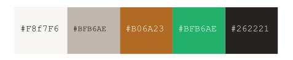

# **Katsit London - Cat sitting agency in London**

Based on a fictional business offering cat sitting services, this website was built for educational purposes as part of the Code Institute's Full Stack Development course. This fully responsive and user centric website was designed using the principles of User Experience Design and developed using HTLM, CSS and bootstrap framework. 

*(add screenshots)*

# **UX Design**  

- ## **Strategy** 

    Katsit London is a small cat sitting company set up by a previous veterinary nurse, who has extensive knowledge and experience in caring for animals. The business has already a formidable reputation, attracting new customers from recommendations and local pages on social media.
 
    Katsit London is fast expanding  and needs a simple, yet comprehensive and responsive website, to create an online presence and advertise their services. 
 
    - ### **Business goals:**
 
      The company needs a fully responsive and user centric website in order to:
        - To create an online presence
        - To advertise their services and pricing
        - To raise their business' brand awareness and credentials
        - To generate new leads and expand their customer base
        - To grow their on-line community
 
    - ### **User goals:**
 
      Cat owners can feel quite anxious at the idea of leaving their pets at home whilst on holiday and need to trust that their pets will be well looked when they are away. Therefore they may have the main following goals in mind when visiting a website:
        - To access the website across different devices and to quickly find information
        - To assess business’s credentials
        - To decide whether the services offered by the company fit their needs
        - To check whether the prices are affordable
        - To check whether the company operates where they live
        - To reach the company for further queries and/or to arrange a meeting 

- ## **User stories**

    - ### **External user stories:**
 
      - <ins>As a first time visitor,</ins>
        - I want a responsive website so that I can view the website across different devices. 
        - I want to be able to easily navigate across the website so that I can find information quickly.
        - I want to read about the company's services so that I can assess whether they fit my needs.   
        - I want to look at prices so that I can check wether I can afford their services. 
 
      - <ins>As a returning visitor</ins>
        - I want to read customer testimonials so that I can assess if the company is reliable and professional.
        - I want to read more about the company so that I can assess its credentials and professionalism. 
        - I want to access contact options so that I can reach the company for further queries.
        - I want to view the areas where the company operates so that I can check that they provide services where I live.
 
      - <ins>As a frequent visitor:</ins>
        - I want to quickly access the company social media account so that I can further check their credentials.
        - I want to contact the company so that I can arrange a meet & greet.

    - ### **Business owner stories:**
 
      - <ins>As a business owner:</ins>
        - I want a user-friendly responsive website so that I can create an online presence.
        - I want to provide clear and concise information so that I can advertise services and pricing.
        - I want a call for action so that I can generate leads.
        - I want to feature a logo and a tagline so that I can raise my business brand awareness.
        - I want to feature my profile so that I can raise my business credentials.
        - I want to encourage users to contact me so that I can answer queries promptly and arrange meet-ups.
        - I want to provide links to our social media accounts so that I can grow my online community.

- ## **Structure**

    - ### **Responsive layout:**

      The website will resize according to the device used for better visibility and user experience.  

            - As a first time visitor, I want a responsive website so that I can view the website across different devices. 
            - As a business owner, I want a user-friendly responsive website so that I can create an online presence.

    - ### **Collapsible navigation menu:**

       The website will feature a fixed navigation menu on top of the page to allow users to easily navigate back and forth. The navigation will be collapsible on mobile devices for better visibility and automatically update according to the user's position on the page for better user experience.

            - As a first time visitor, I want a responsive website so that I can view the website across different devices. 
            - As a first time visitor, I want to be able to easily navigate across the website so that I can quickly find the information I need. 

            - As a business owner, I want a user-friendly responsive website so that I can create an online presence.

    - ### **Hero banner section:**

      This section will feature a hero image with a tagline and a call for action. 

            - As a business owner I want to feature a logo and a tagline so that I can raise my business brand awareness.
            - As a business owner, I want a call for action so that I can generate leads.

   - ### **Services section:**

     This section will feature a description of what is included in the services as well pricing information and a call for action to encourage users to contact the company.

            - As a first time user, I want to read about the company's services so that I can assess whether they fit my needs   
            - As a first time user, I want to look at prices so that I can check wether I can afford their services. 

            - As a business owner, I want to provide clear and concise information so that I can advertise services and pricing.
            - As a business owner, I want a call for action so that I can generate leads.
            
    - ### **About us section:**
    
      This section will feature the profile, a photo and the relevant qualification of the business owner to provide users with information about the business' credentials. 

            - As a returning visitor, I want to read more about the company so that I can assess its credentials and professionalism.  
            - As a business owner, I want to feature my profile so that I can raise my company's brand awareness and credentials.

    - ### **Testimonials section:**

       This section will feature quotes from customers, including full names and photos to add further credibility. The testimonials will be presented in a responsive carousel for better user experience.

            - As a returning visitor, I want to read customer testimonials so that I can assess if the company is reliable and professional.

    - ### **Areas we cover section:**
    
       This section will list the areas the business covers and will feature an embedded map to help users to visualise  where the business operates. Users can use the search tool on the map to look-up if their post-code is in the area covered by the business.

            - I want to view the areas where the company operates so that I can check that they provide services where I live.

    - ### **Contact us section:** 

      The contact page will feature the business' contact details and a form to allow users to contact the business directly via the website. The form will include an option to select the subject of the message so that users can either make a general query or arrange a meet and greet. 

            - As a returning visitor, I want to access contact options so that I can reach the company for further queries.
            - As a frequent visitor, I want to contact the company so that I can arrange a meet & greet.
            - As a frequent visitor, I want to quickly access the company social media account so that I can further check their credentials.

            - As a business owner, I want to encourage users to contact me so that I can answer queries promptly and arrange meets & greets.

    - ### **Footer:** 
 
      The footer will display contact information  and icons with links to the business’s social media accounts opening onto a new tab, so that users can browse these without losing access to the website. 

            - As a frequent visitor, I want to contact the company so that I can arrange a meet & greet.
            - As a frequent visitor, I want to quickly access the company social media account so that I can further check their credentials.

            - As a business owner, I want to provide links to our social media accounts so that I can grow my online community.

- ## **Wireframes**

    The wireframes were created using Balsamic during the skeleton plane of the project and illustrates the structure of the website across different devices.

    You can either view the wireframe [here](documentation/wireframes/wireframes.png) (in png format) or [download](https://a45c73f1-3de6-45f3-bdf8-7fdbe308ac5f.ws-eu03.gitpod.io/files/download/?id=bdb7e86e-0825-49b6-a2f7-0cc69646e029) the pdf version of the wireframes should the images not display properly. 
    [download pdf wireframes]

    ### **Differences to wireframes** 
 
     - In the very early inception of the project (early commits, then removed), the wireframes indicated a three page website, this was quickly changed to a single page website as the project was redefined for a more balanced and eye-catching design with adjustment to UX design.
     - The contact button in the footer doesn’t feature in the final version of the website, as the contact form is close to the footer. 
     - Background images were not used in the contact section as they interfered with, rather than enhanced, the visibility of the contact form.  

- ## **Design**

  - ### **Imagery**
    
    All images on the website have the purpose to either illustrate or highlight the content on display:
     
     - The logo, a cat icon sourced from Shutterstock, features in the header and in browsers to help with brand recognition. For better visibility the favicon is in a dark colour as opposed to the white logo in the navigation. 
     - The hero image on top of the page has for main objectives to grab the user’s attention and to help create an instant connection with the service offered by the business. 
     - The service section uses background images of cats as a way to highlight the text by creating a striking contrast.
     - The testimonial section features images of customers to increase credibility of their recommendations.
 
    Please find using the full list of credits can be found [here](documentation/media_credit.md).
 
  - ### **Colour scheme**
  
    The following colours have been selected for their contrast whilst giving a soft yet modern feel to the website in harmony with the main hero image. This colour palette was created using the Google inspect colour picker and further research from [color-hex](https://color-hex.org/color/b06a23).  

      

     - Dark #262221 is used for text including headings, header and footer background (colour picked).  
     - Brown #B06A23 is used for horizontal lines on light background and hover effect on buttons (color-picked).  
     - White #F8f7F6 is used for white background and on dark background (tint of #BFB6AE).  
     - Beige #BFB6AE is used for light background to create contrast between sections of the website (color picked).  
     - Green #23B06A is used for the buttons (triadic colour of #B06A23).  
 
  - ### **Fonts**
 
     The website uses Open Sans as primary font, whilst the headings and subheadings use the secondary font Poppins, which pairs nicely with Open Sans.
     Both fonts were sourced from Google fonts and were selected for their round edges, which add softness to the website. 
 
  - ### **Icons**
 
     Icons from the Font Awesome library are used to bring attention to contact details and social media accounts. Icons will also be used to add style to the list of services offered.
 
  - ### **Styling**
 
     - Buttons and some text boxes have slightly rounded corners to add a softer feeling and make these elements more noticeable whilst improving user experience on the website.  
     - Credentials information are presented in a circular block to draw the eye to the uniqueness of these elements and breathe life into this section of the website.  
     - Testimonials images are also circular for a more appealing design whilst giving breathing space to the testimonial section.  

  - ### **Differences to design**

    - An initial hero image was tested but did not fulfil the desired visual impact, as it would not resize and accommodate the call for action in an appealing way.  
    - An initial palette was created using Adobe Color however the colour did not render as well as on screen, therefore different choices were made and the palette was finalised more towards the end for better and striking visual impact.  
    - The Green #23B06A was replaced with #078847 to fit accessibility contrast requirements.

- # **Features** 

- ## **Existing features**   
      
    - Responsive design to allow user to browse the website on all devices  
    - Collapsible fixed navigation with scrollspy option to allow users to easily navigate across the website on all screen sizes.  
    - A call for action in form of a hoverable button in the hero banner and service section to invite users to contact the business.   
    - Responsive non-automated carousel with controls and indicators to allow users to flick through customer testimonials.   
    - An embedded map showing the areas covered by the business with search and zoom option so that users can quickly see if the business operates where they live.  
    - Form with validation control to allow users to make contact with the business.  
    - Clickable and hoverable icons to allow users to open social media links into new tabs, whilst retaining navigation on the website.   

- ## **Features left to implement**  

    - GDPR compliant cookie policy via a banner when users first visit the website.    
    - Link the form to a webserver to collect data entered.   
    - A blog to build relationships with current and potential customers, adding further credibility to the business.   
    - Add links to email and phone number, not applicable at present since this website is for a fictional business.

# **Technologies used**

  The following technology were used during the development and testing of the website:
  
  - **Languages**
     - HTML: HTML was used to structure the page 
     - CSS: CSS was used to style the different elements on the page.

  - **Frameworks and libraries**
     - [Bootstrap](https://getbootstrap.com/docs/4.5/getting-started/introduction/): Bootstrap library was used to build the layout using the grid system, the navigation and part of the form.
     - [Flickity](https://flickity.metafizzy.co/): Flickity was used to build the responsive carousel in testimonial section.
     - [Hover.css](http://ianlunn.github.io/Hover/): Hover.css library was used for hovering effects on buttons and social media icons.
     - [Google font](https://fonts.google.com/): Google font API was used for the fonts on the website.
     - [Font Awesome](https://fontawesome.com/): Font awesome library was used for the icons the website. 

  - **Media & wireframes**
  
     - [Balsamiq](https://balsamiq.com/wireframes/): Balsamiq was used to design the wireframe.
     - [Ibis Paint](https://ibispaint.com/?lang=en-US): Ibis Paint app was used to alter the logo and the favicon.
     - [Google drawing](https://chrome.google.com/webstore/detail/google-drawings/mkaakpdehdafacodkgkpghoibnmamcme): Google drawing was used for the final palette in this document.
     - [Carto](https://carto.com/): Carto was used to draw and personalise the embedded map.

  - **Workspaces & respository hosting**

     - [Gitpod](https://www.gitpod.io/): Gitpod was used as a local respoitory to develop the code.
     - [Git](https://git-scm.com/): Git was used for version control from gitpod to save commits and push code onto GitHub.
     - [GitHub](https://github.com/): GitHub was used to save the code and deploy the live site.  

  - **Testing**

     - [Chrome DevTools](https://developers.google.com/web/tools/chrome-devtools): Google inspect was used to test and fix code and page responsiveness.
     - [Responsive viewer](https://www.producthunt.com/posts/responsive-viewer): This add-on was used to test website responsiveness across different devices.
     - [Google lighthouse](https://developers.google.com/web/tools/lighthouse): Google lighthouse was used to assess performance of the site
     - [Wave Accessibility](https://wave.webaim.org/): This tool was used to evaludate accessibility of the webiste.

# **Testing**
  
  Testing has been an on-going process during the coding stage of the project with further tests conducted toward the end. This section covers:

   - Issues and solution during development process
   - Testing User stories 
   - Testing accessibility 
   - Testing performance with Google lighthouse 
   - HTML & CSS validation.  

  Full testing process and results can be found [here](documentation/testing.md). 

# Deployment

 There is no difference between the developed and the deployed version. 

 - ## **Project inception**  
 
 This project was developed using Gitpod, committed to git then pushed onto GitHub using the built-in function within Gitpod.  
 Updates were committed frequently to git and the project pushed onto GitHub on a regular basis to make sure it was saved properly.

 - ## **Deployment on GitHub**

 The project was deployed to GitHub Pages as follows:
 - Log in to GitHub and locate the GitHub Repository lemocla/MS1-Catsitting.
 - Click on "Settings" located in the menu above the repository.
 - Scroll down the "GitHub Pages" section. 
 - Under "Source", select "Master" in the dropdown menu.
 - In the tab next to "Source", select "/root" if not already selected by default 
 - Click save then the page will automatically refresh.
 - The link should show in a banner just above  "GitHub Pages" section.

- ## **How to run the project locally**

- # Credits

 - ## **Code**
   
   The full list of credits for code can be found [here](documentation/code_credit.md). 
   
 - ## **Content**
 
 The content was created by the developer taking inspirations from various cat-sitting companies, more specifically [Chatty Cats Care](https://www.chattycatscare.co.uk/) and the [The London Cat Sitter](https://www.thelondoncatsitter.co.uk/). 
  
 - ## **Media**
 
 The logo was obtained from Shutterstock and the photos used in this website were from Pexels and Pixabay. The full list of credits can be found [here](documentation/media_credit.md)

- ## **Acknowlegements**

