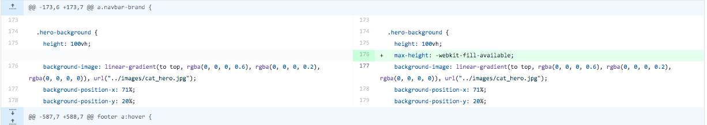

# **Testing - Katsit London**

Testing has been an on-going process during the coding stage of the project with further tests conducted toward the end on user stories, accessibility and performance as well as html & css validation.

# Issues and solution during development process 

## Navigation 

 - **Issue**: Part of the content was hidden under the fixed navigation bar.  

    > **Solution:** The solution was to create fixed invisible anchors positioned above the start of each section, as per suggestion of [Caktus Group blog post](https://www.caktusgroup.com/blog/2017/10/23/css-tip-fixed-headers-and-section-anchors). Invisible anchors were first committed [here](https://github.com/lemocla/MS1-Catsitting/commit/c598a61d3658ca1479b70d3f3ff02e3b3279c1ae?branch=c598a61d3658ca1479b70d3f3ff02e3b3279c1ae&diff=split) with top finally adjusted [here](https://github.com/lemocla/MS1-Catsitting/commit/4678445e7b5e839796a8378d00c7b3e1cafa2e1a#diff-a72d4ee198d130c997b203ecb2f5c54d84617b3cdf7bd9eaab804be78e2709ae), as shown below.
      
      
 
 - **Issue**: When navigating to a section of the website, the link in the navigation didn’t show as active.  

     > **Solution:** After browsing bootstrap library, the solution was to implement [bootstrap scrollspy](https://getbootstrap.com/docs/4.5/components/scrollspy/) as shown in this [commit](https://github.com/lemocla/MS1-Catsitting/commit/17f98e83bdb505cec250a84bc3e69bc61b51da01#diff-0eb547304658805aad788d320f10bf1f292797b5e6d745a3bf617584da017051). The offset of the scrollspy needed to be adjusted so that the links are activated at the start of each section rather than the position of the invisible anchors, as shown [here](https://github.com/lemocla/MS1-Catsitting/commit/95e65d66c56f0f7124315ad8f16d66bd9a60ee8b#diff-0eb547304658805aad788d320f10bf1f292797b5e6d745a3bf617584da017051) and on the screenshot below.

      

      

 - **Issue**: Once collapsed, the menu did not collapse back when clicking on menu items.  

     > **Solution:** This was the most challenging issue during development. The solution was to insert data-toggle="collapse" and data-target=".navbar-collapse.show" in navigation items as suggested in this [stack overflow post](https://stackoverflow.com/questions/42401606/how-to-hide-collapsible-bootstrap-4-navbar-on-click) and as implemented in this [commit](https://github.com/lemocla/MS1-Catsitting/commit/95e65d66c56f0f7124315ad8f16d66bd9a60ee8b?branch=95e65d66c56f0f7124315ad8f16d66bd9a60ee8b&diff=split). Please see below a screenshot sample of the code.
 
      

 - **Issue**: Navigation menu needed to expand at a different breakpoint than those offered as part of the bootstrap library.  

     > **Solution:** Using Google Inspect, I was able to create a media queries for desired breakpoint and recreate the different elements required for navbar-expand to work, as shown in this [commit](https://github.com/lemocla/MS1-Catsitting/commit/5973543c65791051c0eded943fcfdfeec523e17b#diff-a72d4ee198d130c997b203ecb2f5c54d84617b3cdf7bd9eaab804be78e2709ae). 

      
 
## Toggle button 

 - **Issue**: Using Google inspect, I did not seem able to target the element to style the toggle button.  

     > **Solution:** The solution was to replace the bootstrap default toggle button by a Font Awsome icon as suggested by [this stack overflow post](https://stackoverflow.com/questions/42586729/bootstrap-4-change-hamburger-toggler-color). The Font Awesome icon was first added within the span containing the toggler button as shown in this [commit](https://github.com/lemocla/MS1-Catsitting/commit/17f98e83bdb505cec250a84bc3e69bc61b51da01#diff-0eb547304658805aad788d320f10bf1f292797b5e6d745a3bf617584da017051). The span containing the toggler was removed and the toggle-btn navbar-toggler-icon styles moved to the element containing the icon, as shown in this [commit]( https://github.com/lemocla/MS1-Catsitting/commit/95e65d66c56f0f7124315ad8f16d66bd9a60ee8b?branch=95e65d66c56f0f7124315ad8f16d66bd9a60ee8b&diff=split).

     **HTML screenshot** 
     

     **CSS screenshot** 
     

## Paddings 

 - **Issue**: As the website was designed for mobile first, spacing on larger screens was an issue and the different sections of the website needed to occupy more space for better balance.  

     > **Solution:** After some research, responsive paddings were applied at different breakpoints using the clamp function as suggested in this [stack overflow post](https://stackoverflow.com/questions/38078957/can-we-define-min-margin-and-max-margin-max-padding-and-min-padding-in-css/38079002) and as shown in this [commit](https://github.com/lemocla/MS1-Catsitting/commit/b135cf2ef81300bb41a8e59d2663be84809d55f6#diff-690d03bb19dd15d34a545fe631217b9141f4b1e5a9071c8438360914317fd524). During the testing of the user stories, responsive paddings were then changed to a different css function, as shown in this [commit](https://github.com/lemocla/MS1-Catsitting/commit/cca974e40bfefb1c7b611204d9c0faa080620104#diff-690d03bb19dd15d34a545fe631217b9141f4b1e5a9071c8438360914317fd524). 

     **Responsive paddings - clamp function**
     

     **Responsive paddings - max(val-min, min(val-preferred, val-max))**
     

## Background image and i-frame

 - **Issue**: The background image in the "about me" section and the embedded map did not display properly on small screens when occupying the full width.  

     > **Solution:** The solution was in the case of the background image to apply a vmin function to keep the size balanced with the container above, as shown in this [commit](https://github.com/lemocla/MS1-Catsitting/commit/199b43770e882b92b7f7f59bbe94260da3dc7d20#diff-690d03bb19dd15d34a545fe631217b9141f4b1e5a9071c8438360914317fd524). For the frame, a minimum height was applied as displayed in this [commit](https://github.com/lemocla/MS1-Catsitting/commit/8604c77f2ca1edcd53af3713fd8e31e8978cec82#diff-690d03bb19dd15d34a545fe631217b9141f4b1e5a9071c8438360914317fd524), so the content of the map displayed properly.
     
     **About me background image**
     

     **Embedded map** 
     

## Hero image and jumbotron text

  Hero image should cover the full height of the viewport - excluding top and bottom menus - across different devices and screen sizes, whilst in  balance and the jumbotron text being displayed responsively in the best light. 

  - **Issue:** Mobile viewports include top and bottom menus and hero image covers more than the height of the device.
    > **Solution:** Maximum height for the hero image set to -webkit-fill-available so that it doesn’t fill more than the viewport height on mobile, as suggested in this [stack overflow post](https://stackoverflow.com/questions/37112218/css3-100vh-not-constant-in-mobile-browser) and as shown in this [commit](https://github.com/lemocla/MS1-Catsitting/commit/86862a31e46c8dc258f89eff4fce58bb09b5c0cc#diff-690d03bb19dd15d34a545fe631217b9141f4b1e5a9071c8438360914317fd524). 
    > 

  - **Issue:** -webkit-fill-available worked on safari and iphones, but not on devices such as Samsung s10 for example. 
    > **Solution:** Height was also set at 95vh so that the image doesn't overflow as shown in this [commit](https://github.com/lemocla/MS1-Catsitting/commit/0b721f4feba412d2210f07273d155e2b2eb5f8d4#diff-a72d4ee198d130c997b203ecb2f5c54d84617b3cdf7bd9eaab804be78e2709ae)
    > 
  
  - **Issue:** Fixing height at 95vh was causing a gap on small window sizes on desktop, 
    > **Solution:** Adjust media queries in small screens so that hero background image height is set at 100 vh from small screen onward, as shown in this [commit](https://github.com/lemocla/MS1-Catsitting/commit/b39ae2b7847d5fc947a4ffd757af473a85764e88#diff-690d03bb19dd15d34a545fe631217b9141f4b1e5a9071c8438360914317fd524). 
    > 
    >
    > *Note:* the gap is still present on desktop when window size is below 576px, but browsing on such a small window on a desktop is not a likely occurrence. 

  - **Issue:** lack of balance on extra large screens
    > **Solution:**  A final media query was set for extra large screens where the max-height of the hero background is set at 850px to keep the overall website in balance, as shown in this [commit](https://github.com/lemocla/MS1-Catsitting/commit/630752f5885d21ddae2f3efcbcb923965c01a388#diff-690d03bb19dd15d34a545fe631217b9141f4b1e5a9071c8438360914317fd524).   
    >  Issues with navigation bar not being positioned in line with body were resolved [here](https://github.com/lemocla/MS1-Catsitting/commit/61fecc74e18964f676f864c51ea8ee208d803ab3#diff-690d03bb19dd15d34a545fe631217b9141f4b1e5a9071c8438360914317fd524). A sample screenshot is shown below:
    > **Body set at max width of 2000px**
    >  
    > **Navigation**
    >  

  - **Issue:** Jumbotron text needed to be responsive according to the screen size to keep in balance and for better visual impact. 
    > **Solution:**
    > - On portrait viewport (default): text aligned centrally at the bottom of the background image. 
    > - On landscape viewports (and viewport with a ratio less than 5:4): text is vertically aligned on the left of the hero image. Jumbotron container’s width is set with responsive values so that IT doesn't grow over a certain part of the hero image, as shown in this [commit](https://github.com/lemocla/MS1-Catsitting/commit/20a43a4997e0c9d44c0ca3adba824cd7c1dc555f#diff-690d03bb19dd15d34a545fe631217b9141f4b1e5a9071c8438360914317fd524). 
    > 

 - **Issue:** The font in the jumbotron container also needed to be fully responsive to all screen size configuration for maximal visual impact. 
   > **Solution**: The solution was to “clamp” the font size between a minimum and maximum value, as suggested in this post from [css-trick](https://css-tricks.com/how-do-you-do-max-font-size-in-css/) and as shown in this [commit](https://github.com/lemocla/MS1-Catsitting/commit/26872e263ccc0172f1ee334c111d1f1184895bde#diff-a72d4ee198d130c997b203ecb2f5c54d84617b3cdf7bd9eaab804be78e2709ae). During the testing of the user stories, this was then changed to a different css function - max(val-min, min(val-preferred, val-max)) - as shown in this [commit](https://github.com/lemocla/MS1-Catsitting/commit/d127f0c5cd821fad06c8755167ff663891de1e28#diff-a72d4ee198d130c997b203ecb2f5c54d84617b3cdf7bd9eaab804be78e2709ae).
   >
   > **Responsive font - clamp**
   > 
   > 
   > **Responsive font - max(val-min, min(val-preferred, val-max))**
   > 
  
 - **Issue:** Setting -webkit-fill-available for mobile made the jumbotron text not fully visible on landscape mobile devices. 
   > **Solution:** To remedy this issue (although browsing a website on landscape mobile may not be a frequent occurrence), a media query was set so that the promotional text is hidden and bottom padding reduced, as shown in this [commit](https://github.com/lemocla/MS1-Catsitting/commit/ce519e0b70125fe36dac9f87356d5a44a37fee38#diff-a72d4ee198d130c997b203ecb2f5c54d84617b3cdf7bd9eaab804be78e2709ae), to allow text to breathe and be displayed properly. 
   > 

# Testing user stories 

- ### **Introduction**
    The testing of  User Stories is set on the user’s journey across the website and covers interactive elements, as well as the responsiveness of the website across different platforms and browsers.
    
    User stories were tested manually on the following devices and browsers, in addition of Googe inspect and responsive viewer add-on:
    - Devices:  Iphone XR, Samsung S10, Ipad,  MacBook Pro and iMac
    - Browsers: Safari, firefox and Chrome  
    
- ### **As a first time visitor, I want a responsive website so that I can view the website across different devices.**

    - **<ins>T01 - Acceptance criteria</ins>**  

        - When I visit the website using my device, all content is visible and visual elements are displayed proportionally,  

          > **Issues:**   
          > - Responsive paddings were not displayed on tablets
          > - Buttons on ipad text wrapping on 2 lines
          > - Phone number links automatically activated on iphones and ipad
          > - Hero image appeared quite slow to upload 
          >
          >  **Fix**
          >  - Responsive paddings ([view commit](https://github.com/lemocla/MS1-Catsitting/commit/cca974e40bfefb1c7b611204d9c0faa080620104#diff-690d03bb19dd15d34a545fe631217b9141f4b1e5a9071c8438360914317fd524)) were adjusted using a different css function.  
          >     
          >  - Add white-space: nowrap on button as suggested by this [stackoverflow post](https://stackoverflow.com/questions/12707317/ipad-breaks-button-text-into-two-separate-lines/12708061) and as shown in this [commit](https://github.com/lemocla/MS1-Catsitting/commit/d06f2061a1c92c5a63c8e2cdf4f04d697d0f8461#diff-690d03bb19dd15d34a545fe631217b9141f4b1e5a9071c8438360914317fd524).
          >     
          >  - A meta data was added in the header to remove automatic links of phone numbers as suggested by this [blog post](https://n8finch.com/disable-phone-number-linking-ios-safari) and as shown in this [commit](https://github.com/lemocla/MS1-Catsitting/commit/f01c180a90d5b8279ea5037430b6bcb4a8f3e7d3#diff-0eb547304658805aad788d320f10bf1f292797b5e6d745a3bf617584da017051).
               
          >  - Hero image's size was compressed to optimise performance. 

        **T01 Result after fixes: PASS**

    - **<ins>T02 - Acceptance criteria</ins>**
        - When I use a small screen or,
        - When I resize my screen and the menu becomes too large, the navigation bar collapses and,
        - When the navigation is collapsed, a toggler button is displayed to right of the header, and
        - When I click on the toggler button, a vertical menu is displayed,
        - When I click again on the toggler button, the vertical menu collapses back. 
        - When the vertical menu is displayed and I click on any items, the page scrolls to the relevant section and the menu will collapse back.  

        **T02 Result: PASS**

        **Homepage screenshot**

        

 
- ### **As a first time visitor, I want to be able to easily navigate across the website so that I can quickly find information.**
 
    - **<ins>T03 - Acceptance criteria</ins>** 
       - When I scroll to any section of the website, the navigation remains fixed on top of the page and my position on the page is made clear by the relevant link changing appearance (white bold) in the navigation bar. 
       - When I click on a menu item in the navigation bar, the page scrolls to the top of the relevant section of the webpage without spacing or content being covered by the navigation bar.
    
       **T03 Result: PASS**

       **Navigation screenshots**

       

- ### **As a first time visitor, I want to read about the company's services so that I can assess whether they fit my needs / As a first time visitor, I want to look at prices so that I can check whether I can afford their services.**
 
    - **<ins>TO4 - Acceptance criteria</ins>**  

        - when I click on the menu item “services” in the navigation bar, the page scrolls to the “services” section of the website.
        - when I view / scroll to the “services” section, an introduction and a list of items included in the services are displayed as well as three text boxes showing pricing information laid out on top of different images, and
        - when I scroll at the bottom of the section, a “contact-us” button is displayed,
        - when I hover over the button, its appearance changes from green to orange. 
        - when I click on the button, the page scrolls to the “contact us” section. 
 
       **T04 Result: PASS**

       **Services screenshots**

       

- ### **As a returning visitor, I want to read customer testimonials so that I can assess if the company is reliable and professional.**
 
    - **<ins>TO5 - Acceptance criteria</ins>**
        - when I click on the menu item “testimonials” in the navigation bar, the page scrolls to the “testimonials” section of the website.
        - When I view / scroll to the “testimonials section”, a carousel with 2 side buttons and a dotted indicator displays an image, a name and text containing the customer recommendations in quotes.
        - When I hover on either side buttons, the buttons appearance changes (to brown) and,
        - When I click on the right button, the carousel moves one slide to the right,
        - When I click on the left button, the carousel moves one slide to the left, and
        - When I click on one of the dotted indicators, the first slide to be displayed is relevant to the position on the dotter indicator. 

        **T05 Result: PASS**

        **Testimonials screenshots**
        

- ### **As a returning visitor, I want to read more about the company so that I can assess its credentials, professionalism and cat friendliness.**
 
    - **<ins>T06 - Acceptance criteria</ins>** 
        - when I click on the menu item “credentials” in the navigation bar, the page scrolls to the “credentials” section of the website.
        - When I view / scroll to the testimonials section, text and a background image are visible and displayed responsively.  

        **T06 Result: PASS**

        **About me screenshots**
        ![about][screenshots/about_me.png]
 
- ### **As a returning visitor, I want to access contact options so that I can reach the company for further queries.**
 
    - **<ins>T07 - Acceptance criteria</ins>**
        - when I click on the menu item “contact us” in the navigation bar, the page scrolls to the “contact us” section of the website, 
        - when I view or scroll to the “contact us” section, contact details with a phone number and an email address are displayed as well as a contact form containing “full name”, “email address”, “subject” and “message” fields,

      **T07 Result: PASS**
    
    - **<ins>T08 - Acceptance criteria - Form valid path</ins>**
        - when I enter my name in the “full name” field, and
        - when I enter a valid email address in the “email” field and,
        - when I go to the subject field, I can keep the existing selection “general queries” or select “Arrange a meet & greet” and,
        - when I enter a message in the “message field” and,
        - when I click submit, I am brought back to the top of the page (as the form is not linked with any server)

        **T08 Result: PASS**

        **Contact us screenshots**
                
    
    - **<ins>T09 - Acceptance criteria - Form invalid path</ins>**
        - when I enter an invalid email address and when I click submit, a message prompts me to enter a valid email address. 
        - when I leave the “full name” field empty and/or 
        - when I leave the “email” field empty and/or
        - when I leave the “message” field empty and/or
        - when I click submit, a message will appear to prompt me to enter the required fields.      
          > 
          >**Issue:**   
          >  - No message appears when the message field is empty.  
          >  
          > **Fix:**   
          > - Add required to text area element (as shown in this [commit](https://github.com/lemocla/MS1-Catsitting/commit/471e2101fbf9d7ae31d53e188080346e166938cc#diff-0eb547304658805aad788d320f10bf1f292797b5e6d745a3bf617584da017051))
            

        **T09 Result after fixes: PASS**

        **Contact us - invalid path - screenshots**
        
 
    - **<ins>T10 - Acceptance criteria</ins>**
        - when I scroll to the footer of the webpage, the company contact details with a phone number and an email address are displayed

        **T10 Result: PASS**
 
- ### **As a returning visitor,I want to view the areas where the company operates so that I can check that they provide services where I live.**
 
    - **<ins>T11 - Acceptance criteria</ins>**
        - when I click on the menu item “area we cover” in the navigation bar, the page scrolls to the section “Area we cover” of the website.
        - when I view / scroll to the “area we cover” section, a list of areas where the business operates is displayed responsively.
        - when I view the “area we cover” section, a map with a designated zone is displayed and I can zoom in and out, as well as searching my postcode.(the zoom and searching option are third party functionalities)
    
      **T11 Result: PASS**

      **Area we cover screenshots**
      

      *Note* On xxl-screens the embedded map applies a default padding of 8px which results in what appears to be a grey border around the map.

- ### **As a frequent visitor, I want to quickly access the company social media account so that I can further check their credentials.**
 
    - **<ins>T12 - Acceptance criteria</ins>**
        - when I scroll to the footer of the webpage, icons representing facebook, twitter and instagram are displayed and,
        - when I hover over one of the icons, the icon changes in appearance (grow),
        - when I click on one of the icons, I am redirected to the right website in a new tab (ex. Facebook icon redirects to www.facebook.com.).
    
      **T12 - Result: PASS**
      
      **Footer screenshots**
      

- ### **As a frequent visitor, I want to contact the company so that I can arrange a meet & greet.**
 
    - **<ins>T13 - Acceptance criteria</ins>** 
        - When I land on the website, a hero image, jumbotron text and a “contact” us button are displayed responsively,
        - When I hover over the contact us button, it changes in appearance from green to orange.
        - When I click on the “contact us” button, the page scroll to the “contact us” section, 
    
      **T13 - Result: PASS**
      

    - **<ins>Acceptance criteria - Form valid path</ins>**  
    - **<ins>TAcceptance criteria - Form invalid path</ins>**  
        
        Form valid (T08) and invalid paths (T09) have already been tested, please refer to section above. 

    - **<ins>T14 - Acceptance criteria</ins>**
        - when I scroll to the footer of the webpage, the company contact details with a phone number and email address are displayed.  

      **T14 Result: PASS**

# Testing accessibility

  Wave evaluation report was used on the website to assess its accessibility. The report showed the following issues:  

 Initial report can be found [here](reports/waveinitial.jpg)  

 

 - ### **Errors:**  
   - **Contrast on buttons** : Change color from #23B06A to #078847 as shown in this [commit](https://github.com/lemocla/MS1-Catsitting/commit/bb9d32b70a86ea7c20db9861df1cabb0b6d4efab#diff-690d03bb19dd15d34a545fe631217b9141f4b1e5a9071c8438360914317fd524), even if it meant compromising slightly the design.
     

   - **Missing aria-labels on links:** Add aria-labels on links and aria-hidden is true to icons as suggested by [Font Awesome](https://fontawesome.com/how-to-use/on-the-web/other-topics/accessibility) and as shown in this [commit](https://github.com/lemocla/MS1-Catsitting/commit/2a5ec41f083698fc862b0dcf78316bbeb0fed9e9#diff-0eb547304658805aad788d320f10bf1f292797b5e6d745a3bf617584da017051) and as illustrated in the screenshot below.
    

 - ### **Alerts:**
    - **Semantics**: Change headings where necessary and apply heading style to classes  as suggested in this post from [Solodev](https://www.solodev.com/blog/web-design/how-to-adjust-header-styles-with-css-and-bootstrap.stml) and as displayed in this [commit](https://github.com/lemocla/MS1-Catsitting/commit/13f2e26826f07e345bedb63fffa5d6eac9f22489#diff-0eb547304658805aad788d320f10bf1f292797b5e6d745a3bf617584da017051) and as illustrated in the example below.
       

    - **Text align:** Remove text align as shown in this [commit](https://github.com/lemocla/MS1-Catsitting/commit/e0e4fc464baabd7d495753dc7e4a5382c3ab36d2#diff-690d03bb19dd15d34a545fe631217b9141f4b1e5a9071c8438360914317fd524).
        

    - **Not sufficient alt text and broken link for the logo:** Include additional description and change the href link to #home as shown in this [commit](https://github.com/lemocla/MS1-Catsitting/commit/38c05155beda8176b1994ae79d6578d8c0bd9738#diff-0eb547304658805aad788d320f10bf1f292797b5e6d745a3bf617584da017051).
       
   

Wave accessibility final report can be found [here](reports/wavefinal.jpg).  

# Google lighthouse

The following actions taken to improve performance:
- Compress images using tinyjpg 
- Move scripts to bottom from header to the bottom of the page 

The report also flagged up that the title was missing for the iframe for accessibility purposes, which as added as shown in this [commit](https://github.com/lemocla/MS1-Catsitting/commit/a725364349af0f01b7eeac4f027ecf709582c8d8#diff-0eb547304658805aad788d320f10bf1f292797b5e6d745a3bf617584da017051).

*Note:* Many of the recommendations to improve performance concerns third party libararies. 

The best performance that could be achieved:

# HTML & CSS validation 

 - ## **W3C HTML validation** 

    The [W3C HTML validator](https://validator.w3.org/) service was used to insure there is not syntax errors on index.html. The initial report, which can be found [here](reports/w3c_html_error.png) was run using direct input and showed the following mistakes:

    

    **Issues**
    - I-frame: Bad value for width element - digit expected but % is displayed instead 
    - I-frame: Frameborder attribute is obsolete 
    - Stray start tag script 

    **Fixes**
    - Remove frameborder and move width for iframe to css style .mapframe as shown in this [commit](https://github.com/lemocla/MS1-Catsitting/commit/a6fd57600882815f21991625ccfa677fccb825f8#diff-0eb547304658805aad788d320f10bf1f292797b5e6d745a3bf617584da017051).
      
      
    - Move the scripts at the end of the body of html as shown in this [commit](https://github.com/lemocla/MS1-Catsitting/commit/e10b3cdcc461c248b021d06810f24f164bc13081#diff-0eb547304658805aad788d320f10bf1f292797b5e6d745a3bf617584da017051).
      

    The final report, which can can be found [here](reports/w3c_html_success.png) shows that all issues were resolved & that HTML code was validated. 
 
 - ## **W3C CSS validation** 

   The [W3C CSS validator](https://jigsaw.w3.org/css-validator/) service was used using direct input to insure there is no errors in the css styles. The initial report, which can be found [here](reports/w3c_css_errors.png) showed the following mistakes:

   

    - **Issues:** Hide is not value of display.
    - **Fix:** The css was subsequently changed to display:none as shown in this [commit](https://github.com/lemocla/MS1-Catsitting/commit/4232baa58b29e91f882a8de2119ee5fdbef629a6#diff-690d03bb19dd15d34a545fe631217b9141f4b1e5a9071c8438360914317fd524).
      
    - **Warnings:** Many of the browers vendor extension were unknown. 
    - **Fix**: The css file was amended and all the redundant vendors' extensions removed as shown in this [commit](https://github.com/lemocla/MS1-Catsitting/commit/e455d0bcc870ff41834144dc11f8c3dd54bdb76d). Below is an example of the modifications to the code.
       
    
    The final report, which can be found [here](reports/w3c_css_success.png), shows that all issues were resolved & that the CSS styles were validated. 
    
    One alert "-webkit-fill-available is an unknown vendor extension" remains, however this is needed to allow the hero background image to cover the full height on mobile devices.  

    

  
  